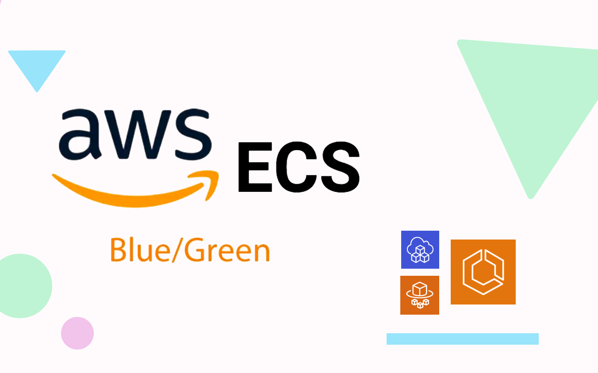

<p align="center">
  <a href="https://dev.to/vumdao">
    
  </a>
</p>
<h1 align="center">
  <div><b>Amazon ECS Farget with Blue-Green Deployments by CDK Typescript</b></div>
</h1>

## Abstract
- Continue the previsous post [Hands-on Amazon ECS for Blue-Green Deployments With CDK Typescript](https://dev.to/aws-builders/hands-on-amazon-ecs-for-blue-green-deployments-with-cdk-typescript-part-1-4ie3) which uses EC2 to host the ECS container service and manually operate blue-green deployments. In this blog post, I use AWS fargate as container of ECS service and codedeploy to operate blue-green deployment automatically.

## Table Of Contents
 * [Solution overview](#Solution-overview)
 * [Source code structure](#Source-code-structure)
 * [Process flow](#Process-flow)
 * [Cleanup](#Cleanup)
 * [Conclusion](#Conclusion)

---

## 🚀 **Solution overview** <a name="Solution overview"></a>


- The whole AWS resources are created using CDK pipleine except the pipeline itself.
- The ECS cluster is placed in private subnet as well as the fargate service. We create ECS service with task defination has desired count 3 and use FARGATE as `requiresCompatibilities`
- The ECS service is registered to ECS deployment controller with type `CODE_DEPLOY` for handling blue-green deployment. It sticks the application load balancer to replacement target group when deploying successfully.
- Container image is built with codepipeline and codebuild which store images to ECR.

  

## 🚀 **Source code structure** <a name="Source-code-structure"></a>
- We have two Git repositories (codecommit) one for application project `app-project` directory and other for CDK infrastructure `cdk-infra` directory

  ```
  ➜  ecs-blue-green-deployments tree -L 1
  .
  ├── README.md
  ├── app-project
  ├── cdk-infra
  └── images

  3 directories, 1 file
  ```

- We create the codecommit repositories through CDK
  - Go to `cdk-infra` and run `cdk ls`
    ```
    cdk ls
    simflexcloud-ecs-blue-green-deployments-pipeline
    simflexcloud-ecs-blue-green-deployments-pipeline/master-sin/EcsBlueGreenDeploymentsStack
    ```

  - Deploy `simflexcloud-ecs-blue-green-deployments-pipeline` it will create the repository of `cdk-infra`. Note: replace `CDK_DEFAULT_ACCOUNT` and `CDK_DEFAULT_REGION` in `cdk-infra/src/shared/constants.ts` with expected ones.
    ```
    cdk deploy simflexcloud-ecs-blue-green-deployments-pipeline
    ```

  - Add the remote Git repository to `cdk-infra` (Note: Replace the `priv-acc` with yours)
    ```
    git remote add origin ssh://priv-acc/v1/repos/ecs-blue-green-deployments-infra
    ```

  - Create branch `master` and push source code to the repo, it will trigger CDK pipeline to create all stacks which also include the repository and pipeline for `app-proj`

  - After the pipeline completed successfully, go to `app-proj` directory and add Git remote repository, then create the branches `testgreen` and `testblue` and push them to codecommit
    ```
    git remote add origin ssh://priv-acc/v1/repos/simflexcloud-ecs-blue-green-deployments
    ```

## 🚀 **Process flow** <a name="Process-flow"></a>
**1. Build project**
  - Use AWS CodeBuild to create Docker images and store them in Amazon ECR. This process is powered by codepipeline to handle CICD.

**2. Create ECS cluster**
  - Create an Amazon ECS cluster using fargate.

    

**3. Application load balancer**
  - We have two rules:
    - Port 80: main rule

      

    - Port 8080: testing rule

      

  - The ALB is currently sticked to the target group green

      

4. CodeDeploy application and deployment group
  - A CodeDeploy deployment group that orchestrates ECS blue-green deployments.

      

## 🚀 **Test the blue green deployments**
- Test the blue service by loading ALB DNS

  

- Now we change the color to red in `app-proj/index.html` and push the commit to CodeCommit. It triggers the pipeline to build and then deploy new change

  

- The deploy stage creates codedeploy deployment ID to perform deployment process and handle Traffic shifting progress strategy with rule `LINEAR_10PERCENT_EVERY_1MINUTES`

  

- ECS run new tasks with new image version on the ECS service

  

- After the new tasks are in healthy state, the deployment starts rerouting production traffic to replacement task set gradually follow the rule `LINEAR_10PERCENT_EVERY_1MINUTES`

  

  

- Use port 8080 for testing and compare with current version

  

- Complete the replacement and start terminating the original task set

  

- ECS remove the tasks with old revision

  

- The final result

  

## 🚀 **Cleanup** <a name="Cleanup"></a>
- To cleanup all resoures in this project, we first need to delete the ECR image as they were not created by CDK and prevent CDK to destroy the ECR repository.
- Go to cloudformation and delete stacks.

  

## 🚀 **Conclusion** <a name="Conclusion"></a>
- Now that you know how to launch tasks into your Amazon ECS cluster using CDK pipeline with required type EC2 or Fargate.
- The approach of a blue-green deployment involves utilizing two identical production environments as a means of reducing downtime. Various cutover strategies may be employed, but typically only one of the environments should be actively serving production traffic.

---
References:
- [BLUE/GREEN DEPLOYMENTS ON ECS FARGATE](https://ecsworkshop.com/blue_green_deployments/update_code_commit/)

---
<h3 align="center">
  <a href="https://dev.to/vumdao">:stars: Blog</a>
  <span> · </span>
  <a href="https://github.com/vumdao/ecs-blue-green-deployments">Github</a>
  <span> · </span>
  <a href="https://stackoverflow.com/users/11430272/vumdao">stackoverflow</a>
  <span> · </span>
  <a href="https://www.linkedin.com/in/vu-dao-9280ab43/">Linkedin</a>
  <span> · </span>
  <a href="https://www.linkedin.com/groups/12488649/">Group</a>
  <span> · </span>
  <a href="https://www.facebook.com/CloudOpz-104917804863956">Page</a>
  <span> · </span>
  <a href="https://twitter.com/VuDao81124667">Twitter :stars:</a>
</h3>